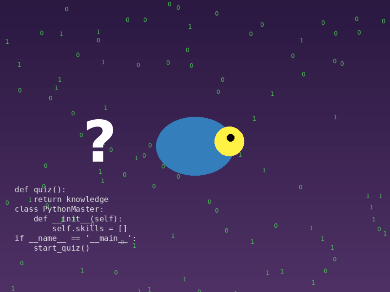

# Python Quiz Master

An interactive quiz application with an animated GUI that tests your knowledge across multiple topics.



## Features

- Beautiful animated interface with binary rain effect
- Multiple quiz topics (Languages, History, Literature, etc.)
- User authentication system
- Score tracking and leaderboards
- Add, view, and delete quiz topics and questions
- Difficulty levels for questions

## Requirements

- Python 3.8+
- PostgreSQL database
- Required Python packages:
  - tkinter
  - pygame
  - psycopg2
  - PIL (Pillow)

## Installation

1. Clone the repository:

   ```
   git clone https://github.com/YourUsername/project-databases-command-line-quiz-AleenDam.git
   cd project-databases-command-line-quiz-AleenDam
   ```

2. Install the required packages:

   ```
   pip install pygame psycopg2-binary pillow
   ```

3. Set up the PostgreSQL database:

   - Create a database named 'quiz_db'
   - Update the database connection details in `scripts/db.py` if needed

4. Generate sound files (optional):

   ```
   python scripts/create_sounds.py
   ```

5. Generate welcome image (optional):
   ```
   python scripts/create_welcome_image.py
   ```

## Running the Application

### Using the Launcher Script (Recommended)

```
python run.py
```

This launcher script will:

- Check for required dependencies and offer to install them
- Generate sound files and welcome image if they don't exist
- Let you choose between the GUI and command-line versions

### Animated GUI Version (Alternative)

```
python scripts/animated_gui_new.py
```

### Command Line Version

```
python scripts/main.py
```

## Usage

1. Register a new account or login with existing credentials
2. From the main menu, select an option:
   - Take a quiz
   - Add new questions
   - View all topics
   - Delete topics
   - Display questions from a topic
   - View scores
   - And more!

## Project Structure

- `scripts/` - Contains all Python scripts
  - `animated_gui_new.py` - Main GUI application
  - `main.py` - Command-line interface
  - `auth.py` - Authentication functions
  - `db.py` - Database connection
  - `questions.py` - Question management
  - `quiz_functions.py` - Core quiz functionality
  - `create_sounds.py` - Generates sound effects
  - `create_welcome_image.py` - Creates welcome image
- `images/` - Contains images used in the application
- `sounds/` - Contains sound effects

## Running Online

You can run this application online using GitHub Codespaces:

1. Go to the GitHub repository
2. Click on the "Code" button
3. Select the "Codespaces" tab
4. Click "Create codespace on main"
5. Once the codespace is ready, run:
   ```
   python run.py
   ```

This will automatically check for dependencies, create necessary resources, and let you choose which version to run.

### GitHub Pages Demo

You can also view a demo of the application on GitHub Pages:

1. Go to: https://yourusername.github.io/project-databases-command-line-quiz-AleenDam/
2. This will show a web-based demonstration of the application's features

## Original Project Requirements

### Implementation Features

1. The application prompts the user with an initial menu where they can select to be tested on an existing topic or enter a new topic/new question or exit.

2. If the user selects to be tested on an existing topic, the application randomly selects questions from the PostgreSQL database. Each question is displayed with multiple possible answers. The user selects the answer they believe is correct, and after all questions are answered, the user's total score is displayed.

3. The questions are stored and retrieved from the PostgreSQL database. For each main topic, there is a separate table with entries for difficulty level (1, 2, or 3), question, right answer, and wrong answers.

4. Users can add additional questions by choosing the main topic and entering each field in sequence, including the question, the correct answer, and wrong answers.

## License

This project is licensed under the MIT License - see the LICENSE file for details.

## Acknowledgments

- Created by AleenDam
- Special thanks to DCI for the project inspiration
